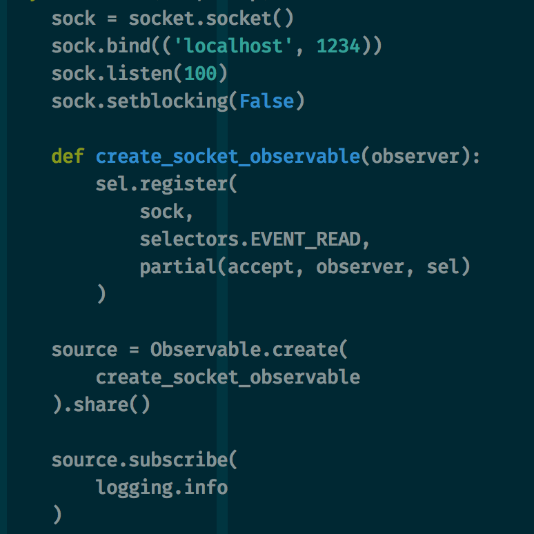

footer: George Adams IV, 2016
slidenumbers: true

# ReactiveX for Python


---

## George Adams IV

### Father of Two

### Full-Stack / DevOps Engineer

---

# Dunning-Kruger


---

# Agenda

- The Pattern
- Hot & Cold
- Running Code Examples

---

# The Pattern


---

# The Pattern

1. Create data source(s)
1. Define observation(s)
1. Add subscription(s)

---

# Observable

```
Observable.timer(0, 1000)
Observable.create(lambda o: o.on_next(42))
```

---

# Observer

```
class MyObserver(Observer):
    def on_next(value):
        pass

# on_error, on_completed
```

---

# Observing with Lambdas

```
source.select(
    lambda x: x * 2
)
```

# Scheduler

Defines where and when to do work.

- asyncio
- gevent
- Tornado
- more

---

# Subjects

"Never" use them.

---

# Hot & Cold


---

# Hot & Cold

A *cold* Observable is _not_ producing values.

A *hot* Observable _is_ producing values.

---

# If a tree falls in the woods...

Observables do not produce values until there's a subscription.

---

# Code


